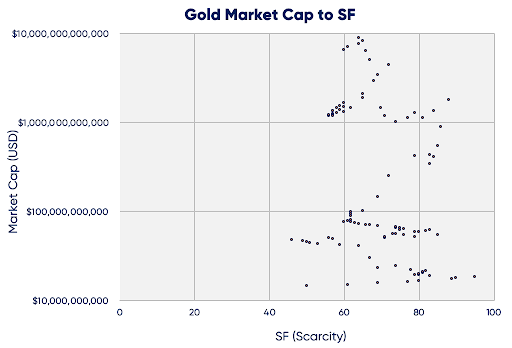

# Why The Bitcoin Stock-to-Flow Model Is a Bad Model

The bitcoin stock-to-flow model was popularized by a Dutch institutional investor that goes by the twitter handle "PlanB". In his paper titled "Modelling Bitcoin Value with Scarcity", he models bitcoin's price to its scarcity. PlanB claims a direct relationship between the price of bitcoin with scarcity, which he describes as a ratio of stock to flow, where stock is the existing supply and flow is a representation of the rate of new supply (through mining).

According to PlanB, precious metals like gold and silver have maintained a monetary role throughout history because they have "unforgeable scarcity" and low rate of supply. For example, gold is valuable because newly mined gold is insignificant when compared to the existing stockpile and because it is impossible to represent the vast supply of gold across the globe-hence it is unforgeable. PlanB argues that this same logic applies to bitcoin.

Bitcoin is mined using arrays of high-performance GPUs and hence costs a lot of electricity in mining new bitcoin. Also for a miner to mine a unit of bitcoin, other miners on the network have to verify the miner's work through a consensus, this makes it extremely hard to fake the mining of bitcoin. PlanB defined scarcity as a low rate of supply and can be quantified with a metric called Stock-to-Flow (SF)

PlanB claims that a direct relationship exists. That scarcity (as measured by the SF metric) directly drives the value of bitcoin. He collected data on bitcoin's monthly SF and value from December 2009 to February 2019 using the number of blocks per month and block subsidy, he calculated the flow and stock. He ran a linear regression model on the collected data with the price data of bitcoin and concluded there is a significant statistical relationship between SF and the price of bitcoin. His model gave a prediction of $1 trillion market cap after the bitcoin halving that occurred in May 2020, this translates to a price of $55,000.

The prediction his model gave is way off, as bitcoin currently trades for around $10,482 (at the time of writing). Apart from this, there is evidence that proves the model is not as reliable as people thought.

One of the predictions of the model was that the price of bitcoin will go to infinity in the year 2140, which is when we can no longer mine new bitcoins, but according to author Francis Tapon's research report: for this to be true, bitcoin's price would have to double every year on average for the next 30 years which is extremely difficult once an asset becomes large.

Another flaw Tapon found include the fact that the price of gold is not driven by it's stock-to-flow. Over the last 100 years, gold held market cap values between $60 billion to $9 trillion all at the same SF of 60.

Also, there are metals with extremely low SF worth more than gold, an example of which is palladium. Palladium currently trades at $2,327.84 with a stock-to-flow ratio of 0.4 with gold trading at $1909.40.

While a high SF value may be a necessary feature for a commodity to serve as a store of value, the metric says nothing about how market participants value said commodity.
